# Overview

## System Context

```mermaid
flowchart LR
  Caller(["👤 Caller<br/>(DevOps Deploy Host)"])
  
  subgraph Engine["Retention Engine"]
    Core["Evaluation Service<br/>• Validates inputs<br/>• Ranks releases<br/>• Returns decisions"]
  end
  
  DataSource[("📊 Data Source<br/>Projects, Environments<br/>Releases, Deployments")]
  
  Caller -->|"EvaluateRetention<br/>(n, inputs)"| Core
  DataSource -.->|"Provides"| Caller
  Core -->|"RetentionResult<br/>(kept releases +<br/>decision log)"| Caller
  
  style Engine fill:#ccffcc
  style DataSource fill:#e1f5ff
```

## Purpose

Implement a **Release Retention** engine that determines which releases to keep, reducing storage usage and improving usability/performance by enabling deletion of older, inactive releases. [Source: Start Here - Instructions - Release Retention.md:L10-L22]

## In Scope

- Evaluate retention decisions for **all project/environment combinations** present in the input sets, in a single invocation. [Source: Start Here - Instructions - Release Retention.md:L27-L33]
- For each project/environment combination, keep `n` releases that have most recently been deployed. [Source: Start Here - Instructions - Release Retention.md:L27-L33]
- Return the kept releases and a machine-readable decision log explaining why each kept release is kept. [Source: Start Here - Instructions - Release Retention.md:L25-L40]
- Provide deterministic behavior (ordering, tie-breakers, invalid reference handling) suitable for unit tests. [Source: Start Here - Instructions - Release Retention.md:L25-L40]

## Out of Scope

- UI, CLI, database persistence. [Source: Start Here - Instructions - Release Retention.md:L25-L40]
- Physical deletion of artifacts/logs (not required by the exercise); may be discussed as an enhancement. [Source: Start Here - Instructions - Release Retention.md:L10-L22]

## Actors

- **Caller**: invokes retention evaluation with input sets and `n`.  
- **Retention Engine**: computes kept releases + decision log.

## Success Metrics

- Correctness: kept releases match rule “top `n` by most recent deployment per project/environment”. [Source: Start Here - Instructions - Release Retention.md:L27-L33]
- Determinism: identical inputs produce identical outputs (ordering + selection). [Source: Start Here - Instructions - Release Retention.md:L25-L40]
- Test coverage sufficient for production code standard. [Source: Start Here - Instructions - Release Retention.md:L25-L40]
