# Architecture

## Container View

```mermaid
flowchart TB
  Caller(["👤 Caller<br/>(Host Process)"])
  
  subgraph Library["Retention Engine Library (.NET 8)"]
    direction TB
    
    subgraph Application["Application Layer"]
      Service["EvaluateRetentionService<br/>• Validates inputs<br/>• Converts DTOs<br/>• Orchestrates evaluation"]
    end
    
    subgraph Domain["Domain Layer"]
      Evaluator["RetentionPolicyEvaluator<br/>• Ranks releases<br/>• Applies tie-breakers<br/>• Pure business logic"]
    end
    
    subgraph Observability["Observability"]
      Telemetry["RetentionTelemetry<br/>• ActivitySource<br/>• Meter"]
    end
    
    Service --> Evaluator
    Service --> Telemetry
    Evaluator -.->|"callback"| Telemetry
  end
  
  OTel["📊 OpenTelemetry SDK<br/>(System.Diagnostics)"]
  
  Caller -->|"EvaluateRetention()"| Service
  Service -->|"RetentionResult"| Caller
  Telemetry -.->|"Activities<br/>Metrics"| OTel
  
  style Library fill:#ccffcc
  style Application fill:#e3f2fd
  style Domain fill:#fff3e0
  style Observability fill:#f3e5f5
  style OTel fill:#e1f5ff
```



## Primary Flow


## Containers

1. **Retention Engine (Library)**  
   - Provides the application service `EvaluateRetention(...)` and returns decisions.  
   - No UI/CLI/DB dependencies. [Source: Start Here - Instructions - Release Retention.md:L25-L40]

2. **Optional Host (Process Boundary)**  
   - Not required by the exercise; may be used to demonstrate structured logging at a boundary.  
   - Catch/log exceptions at the process boundary only. [Source: Start Here - Instructions - Release Retention.md:L25-L40]

## Components (Clean Architecture)

### Retention.Domain
- Entities: `Project`, `Environment`, `Release`, `Deployment`
- Domain Service: `RetentionPolicyEvaluator`
  - Inputs: deployments grouped by project/environment, `n`
  - Output: ranked selections and deterministic reasons (no logging side-effects)

### Retention.Application
- Use Case: `EvaluateRetentionUseCase`
  - Validates inputs + `n`
  - Converts domain results into DTOs: `RetentionResult`, `DecisionLogEntry`

### Retention.Infrastructure (Optional)
- Logging: structured logger adapter that emits decision logs at boundary (caller/host choice).

## Workflow: Retention Evaluation (Primary)
1. Validate `n` (REQ-0009).  
2. Build lookup maps for projects/environments/releases; validate and classify invalid references (REQ-0010).  
3. Group deployments by `(ProjectId, EnvironmentId, ReleaseId)`; compute `max(DeployedAt)` per release per environment (REQ-0003, REQ-0004).  
4. For each `(ProjectId, EnvironmentId)`, rank releases by latest deployed time and tie-breakers; select top `n` (REQ-0003..REQ-0006).  
5. Emit `RetentionResult` (kept releases) + `DecisionLog`. (REQ-0007, REQ-0008)

## Error and Exception Strategy

### Principles
- Domain layer returns typed results for expected rule outcomes; throws typed exceptions only for invariant violations.  
- Boundary-only catch in optional host/caller; do not catch broadly inside domain/application.  
- Log once at boundary with structured fields: `error_code`, `correlation_id`, `operation`, `environment_id`, `project_id`, `release_id`. [Source: Start Here - Instructions - Release Retention.md:L25-L40]

### Typed Error Categories
- `ValidationException` (e.g., `n < 0`, null element)
- `DomainException` (domain invariant breach)
- `UnexpectedException` (unclassified; boundary-only)

### Mapping Table

| Error category | Host action / HTTP mapping (if wrapped) | Retry? | User message | Log level |
|---|---|---:|---|---|
| ValidationException | 400 ProblemDetails `validation_error` | No | “Invalid input.” | Warning |
| DomainException | 500 ProblemDetails `domain_invariant` | No | “Internal rule violation.” | Error |
| UnexpectedException | 500 ProblemDetails `unexpected_error` | No (until classified) | “Unexpected error.” | Critical |
## Separation of Concerns

The retention engine is designed as a pure library with no I/O, logging, or persistence side-effects in its core logic. [Source: Start Here - Instructions - Release Retention.md:L25-L40]

### Layer responsibilities
- **Domain**: pure business rules; no dependencies on infrastructure concerns
- **Application**: orchestrates domain services; converts results to DTOs; validates inputs
- **Infrastructure**: adapters for optional concerns (e.g., structured logging); only used at boundary

### Host boundary
The optional host process is responsible for:
- Wiring dependencies (composition root)
- Catching and logging exceptions at the process boundary
- Emitting telemetry (if observability addendum is implemented)

The core library does not dictate host implementation and remains reusable in different contexts (CLI, service, batch job). [Source: ADR-0002-library-first.md#Decision]

## Performance Considerations

### Performance
Performance: single pass over deployments; per (project, environment) group we sort releases for deterministic ordering.

### Allocation and memory
- Use efficient data structures: dictionaries for lookups; avoid repeated LINQ materializations
- Minimize intermediate allocations in hot paths (ranking/tie-breaking)
- Decision log entries are allocated once per kept release

### Synchronous execution
The core evaluator is synchronous and does not perform I/O. This makes it:
- Deterministic and testable
- Suitable for embedding in async host contexts without blocking threads
- Free of concurrency/locking concerns in the library itself

[Source: Start Here - Instructions - Release Retention.md:L25-L40]

## Composition Root and Dependency Injection (Host)

The retention library does not require or enforce a specific DI container. [Source: ADR-0002-library-first.md#Decision]

### Host wiring responsibilities
The optional host is responsible for:
1. Instantiating domain services (`RetentionPolicyEvaluator`)
2. Instantiating application use case (`EvaluateRetentionUseCase`)
3. Injecting infrastructure adapters (e.g., logger) if used

### Example composition (pseudo-code)
```csharp
// Composition root in host
var logger = new StructuredLogger(config);
var evaluator = new RetentionPolicyEvaluator();
var useCase = new EvaluateRetentionUseCase(evaluator, logger);

// Call from host boundary
var result = useCase.Execute(inputData, n);
```

The library provides constructor-based dependencies only; no service locator or framework magic is required.

## Cloud-Native Host Considerations (Twelve-Factor)

If the retention engine is deployed as a service/worker, apply cloud-native principles at the host level. [Source: Start Here - Instructions - Release Retention.md:L25-L40]

### Configuration
- Externalize `n` and other operational parameters via environment variables or config providers
- No hardcoded values in the library; configuration is injected at the boundary

### Statelessness
- The retention evaluator is stateless; each evaluation is independent
- No in-process caching or shared mutable state
- Horizontal scaling is trivial (no coordination required)

### Observability and health
- Health endpoint (if implemented): return 200 OK if process is responsive
- Readiness: true if dependencies (if any) are available
- Telemetry export: configure exporter (e.g., OTLP) in host; core library emits spans/metrics via abstractions

**Note**: Specific exporter implementations and external standards (e.g., OpenTelemetry OTLP) are deferred to host-level decisions. The observability addendum describes patterns; exporter wiring is a TODO for production deployment.

### Logging
- Use structured logging at the host boundary
- Include correlation identifiers (trace id) in all log entries
- Decision log entries are emitted by the library but formatted/exported by the host adapter
## ADR Index

- ADR-0001 Greenfield module + Clean Architecture
- ADR-0002 Library-first API
- ADR-0003 Deterministic ranking and tie-breakers
- ADR-0004 Decision logging strategy
- ADR-0005 Invalid reference handling strategy
- ADR-0006 Coordinated deletion plan (idea only; not required by exercise)

## Addenda

- Observability: see `docs/12_Observability_Addendum.md`. [Source: docs/inputs/Addendum_Request_Observability_and_Deletion.md#Request]
- Coordinated deletion: see `docs/13_Coordinated_Deletion_Addendum.md`. [Source: docs/inputs/Addendum_Request_Observability_and_Deletion.md#Request]
