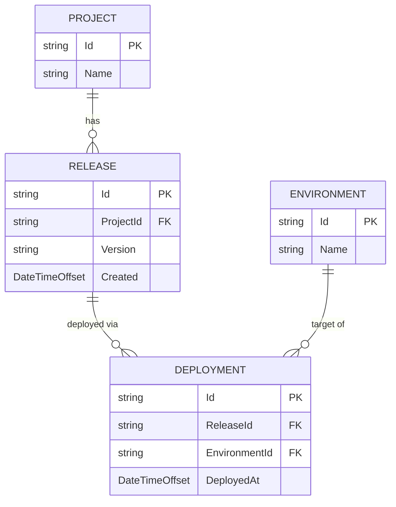

# Domain Model

## Entity Relationships

## Ubiquitous Language

- **Project**: the unit being deployed (application/service). [Source: Start Here - Instructions - Release Retention.md:L25-L40]
- **Environment**: a deployment target collection (e.g., Staging, Production). [Source: Start Here - Instructions - Release Retention.md:L25-L40]
- **Release**: a snapshot/version of a project. [Source: Start Here - Instructions - Release Retention.md:L25-L40]
- **Deployment**: an event of deploying a release to an environment. [Source: Start Here - Instructions - Release Retention.md:L25-L40]
- **Retention Evaluation**: computing which releases to keep for each project/environment using parameter `n`. [Source: Start Here - Instructions - Release Retention.md:L27-L33]
- **Decision Log**: structured explanation for why a release is kept (and diagnostics for invalid input references). [Source: Start Here - Instructions - Release Retention.md:L25-L40]

## Bounded Contexts

- **Release Management Context** (external): owns Projects, Releases, Environments, Deployments (data source). [Source: Start Here - Instructions - Release Retention.md:L25-L40]
- **Retention Context** (this solution): owns retention policy evaluation and decision logging.

## Aggregates and Invariants

### Application Boundary: RetentionEvaluation
- Invariant: `n >= 0` (REQ-0009). [Source: Start Here - Instructions - Release Retention.md:L25-L40]
- Invariant: evaluation considers **all environments** in the provided environment set (REQ-0006). [Source: Start Here - Instructions - Release Retention.md:L75-L86]
- Output determinism: ranking tie-breakers fixed (REQ-0005).

### Domain Service: RetentionPolicyEvaluator
- Invariant: eligibility requires >=1 deployment to the relevant environment (REQ-0002).
- Invariant: “most recently deployed” uses max(DeployedAt) per release per environment (REQ-0004).
- Invariant: produces deterministic ranked list per project/environment (NFR-0003).

## Domain Events (Optional / Future)
- `RetentionEvaluated` (for audit)
No event transport requirements provided; remain TODO. [Source: Start Here - Instructions - Release Retention.md:L25-L40]
