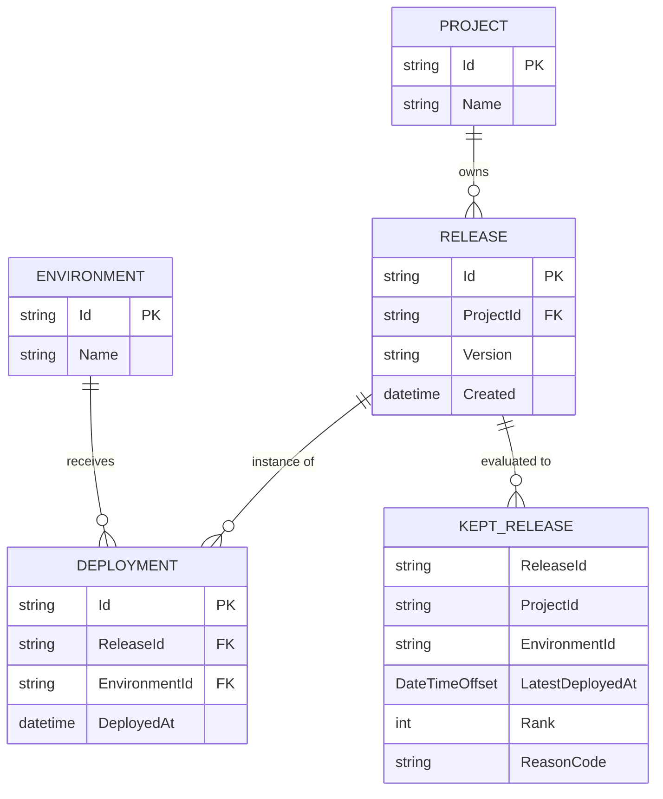

# Data Model

## Entity Model

## Logical Entities

### Project
- `Id` (string)
- `Name` (string) [Source: Projects.json]

### Environment
- `Id` (string)
- `Name` (string) [Source: Environments.json]

### Release
- `Id` (string)
- `ProjectId` (string)
- `Version` (string | null)
- `Created` (datetime string) [Source: Releases.json]

### Deployment
- `Id` (string)
- `ReleaseId` (string)
- `EnvironmentId` (string)
- `DeployedAt` (datetime string) [Source: Deployments.json]

## Relationships
- Project 1..* Release
- Release 0..* Deployment
- Environment 0..* Deployment [Source: Start Here - Instructions - Release Retention.md:L25-L40]

## Retention Outputs (DTOs)

### KeptRelease
- `ReleaseId`
- `ProjectId`
- `EnvironmentId`
- `Version` (copied from Release)
- `Created` (copied from Release)
- `LatestDeployedAt`
- `Rank`
- `ReasonCode` (stable enum/string)

### DecisionLogEntry
- `ProjectId`
- `EnvironmentId`
- `ReleaseId`
- `n`
- `Rank`
- `LatestDeployedAt`
- `ReasonText`

## Retention and PII
- PII classification is TODO (inputs are ids/names only in samples).  
- Log entries must avoid secrets and should not dump full payloads by default. [Source: Start Here - Instructions - Release Retention.md:L25-L40]

## Migrations / Rollout
- No database is introduced by this solution (NFR-0002). [Source: Start Here - Instructions - Release Retention.md:L25-L40]
