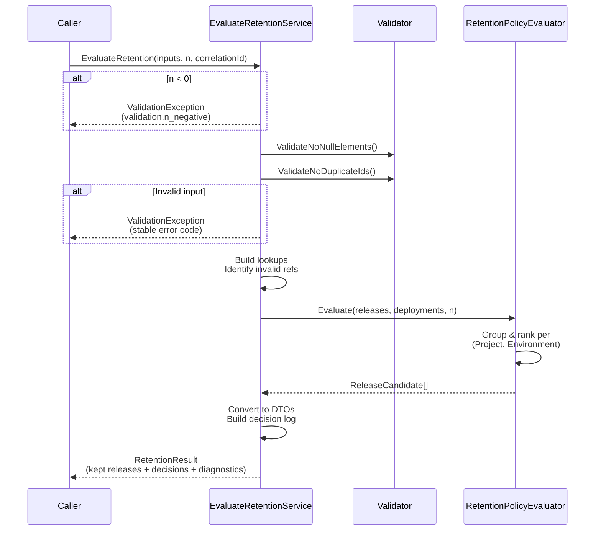

# API Contracts

## API Flow

## Public Application API (Library)

### `EvaluateRetention`

**Signature (conceptual):**
- Input:
  - `IReadOnlyList<Project> projects`
  - `IReadOnlyList<Environment> environments`
  - `IReadOnlyList<Release> releases`
  - `IReadOnlyList<Deployment> deployments`
  - `int releasesToKeep` (`n`)
  - `string correlationId` (optional; generated by caller if absent)
- Output:
  - `RetentionResult`

**Validation Rules**
- `releasesToKeep >= 0` else `ValidationException` with code `validation.n_negative` (REQ-0009). [Source: Start Here - Instructions - Release Retention.md:L25-L40]
- Null collections treated as empty; null elements rejected with `ValidationException` code `validation.null_element`. TODO confirm caller expectations. [Source: Start Here - Instructions - Release Retention.md:L25-L40]

### `RetentionResult`
- `IReadOnlyList<KeptRelease> KeptReleases` (deterministic ordering)
- `IReadOnlyList<DecisionLogEntry> Decisions`
- `RetentionDiagnostics Diagnostics`

## Versioning
- Package versioning uses SemVer; breaking changes to public contracts require major bump. No further release engineering requirements provided. TODO. [Source: Start Here - Instructions - Release Retention.md:L25-L40]

## If Exposed Over HTTP (Optional Wrapper)
- If an HTTP API is later required, wrap `EvaluateRetention` behind an ASP.NET Core endpoint and return RFC7807 ProblemDetails for failures.
