# Security and Trust Boundaries

## Trust Boundary Architecture

```mermaid
flowchart TB
  subgraph External["🔓 Untrusted - External System"]
    Source[("Data Source<br/>(DevOps Deploy)")]
  end
  
  subgraph Boundary["🔒 Trust Boundary"]
    direction TB
    Validate["Input Validation<br/>- Null checks<br/>- Duplicate IDs<br/>- Invalid refs"]
  end
  
  subgraph Engine["✅ Trusted - Retention Engine"]
    direction TB
    App["Application Layer<br/>EvaluateRetentionService"]
    Domain["Domain Layer<br/>RetentionPolicyEvaluator"]
    
    App --> Domain
  end
  
  subgraph Output["📤 Output Boundary"]
    Results["RetentionResult<br/>- Kept releases<br/>- Decision log<br/>- Diagnostics"]
  end
  
  Source -->|"Projects<br/>Environments<br/>Releases<br/>Deployments"| Validate
  Validate -->|"Validated<br/>+ Lookups"| App
  Domain -->|"ReleaseCandidate[]"| Results
  
  style External fill:#ffcccc
  style Boundary fill:#ffffcc
  style Engine fill:#ccffcc
  style Output fill:#ccccff
```

## Trust Boundaries

- Inputs (projects/environments/releases/deployments) originate externally; treat as untrusted and validate references and required fields. [Source: Start Here - Instructions - Release Retention.md:L25-L40]
- This exercise does not require deletion or store credentials; avoid introducing secret-handling unless implementing optional enhancements. [Source: Start Here - Instructions - Release Retention.md:L25-L40]

## Authentication and Authorization
- No authn/z requirements provided for this exercise; assume embedding system handles identity. TODO if exposed externally. [Source: Start Here - Instructions - Release Retention.md:L25-L40]

## Secrets
- No secrets required by core evaluation.  

## Audit Logging
- Decision logs provide audit trail: which releases kept, why, and parameter `n`, plus correlation id if present. (REQ-0008) [Source: Start Here - Instructions - Release Retention.md:L25-L40]

## Data Minimization
- Log identifiers and timestamps only; avoid emitting entire payloads. [Source: Start Here - Instructions - Release Retention.md:L25-L40]
