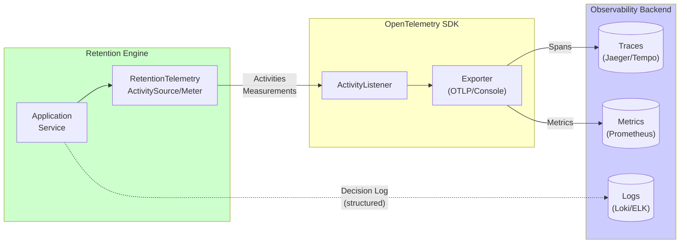

# Operations

## Observability Architecture

## Logging
- Emit decision logs using returned decision entries (library has no side effects by default).  
- If an optional host is used, log at boundary only; do not double-log. Fields:
  - `correlation_id`
  - `operation` = `retention.evaluate`
  - `environment_id`
  - `project_id`
  - `release_id`
  - `decision_code` (kept/invalid_reference)
  - `latest_deployed_at`
  - `n` [Source: Start Here - Instructions - Release Retention.md:L25-L40]

## Metrics (Optional)
- `retention_evaluations_total`
- `retention_projects_evaluated_total`
- `retention_kept_releases_total`
- `retention_invalid_deployments_total`
- `retention_duration_ms` (caller-level timer)

## Tracing
- Propagate `correlation_id` from caller; if absent, caller generates one. [Source: Start Here - Instructions - Release Retention.md:L25-L40]

## Alerts (Top 3)
1. High `retention_invalid_deployments_total` rate (data integrity regression).  
2. Retention evaluation duration spike (performance regression). [Source: Start Here - Instructions - Release Retention.md:L10-L22]
3. Unexpected exception rate > 0 (stability regression). [Source: Start Here - Instructions - Release Retention.md:L25-L40]

## Runbooks (Top 3)

### RB-001 Retention decisions look wrong
- Verify inputs and `n` (REQ-0001/REQ-0009).
- Check tie-breaker assumptions (Q-0001).
- Re-run evaluation with same inputs and compare deterministic outputs.

### RB-002 Invalid deployments detected
- Inspect diagnostic decision entries (REQ-0010).
- Remediate upstream data producing unknown ids.

### RB-003 Determinism regression
- Re-run the same evaluation twice and diff outputs (NFR-0003).
- Validate tie-breaker implementation (REQ-0005).

## Deploy/Rollback Notes
- As a library, deployment is package update in embedding system.

## Observability (Addendum)

- OTel tracing/metrics guidance is defined in `docs/12_Observability_Addendum.md`. [Source: ADR-0007-observability-opentelemetry.md#Decision]
