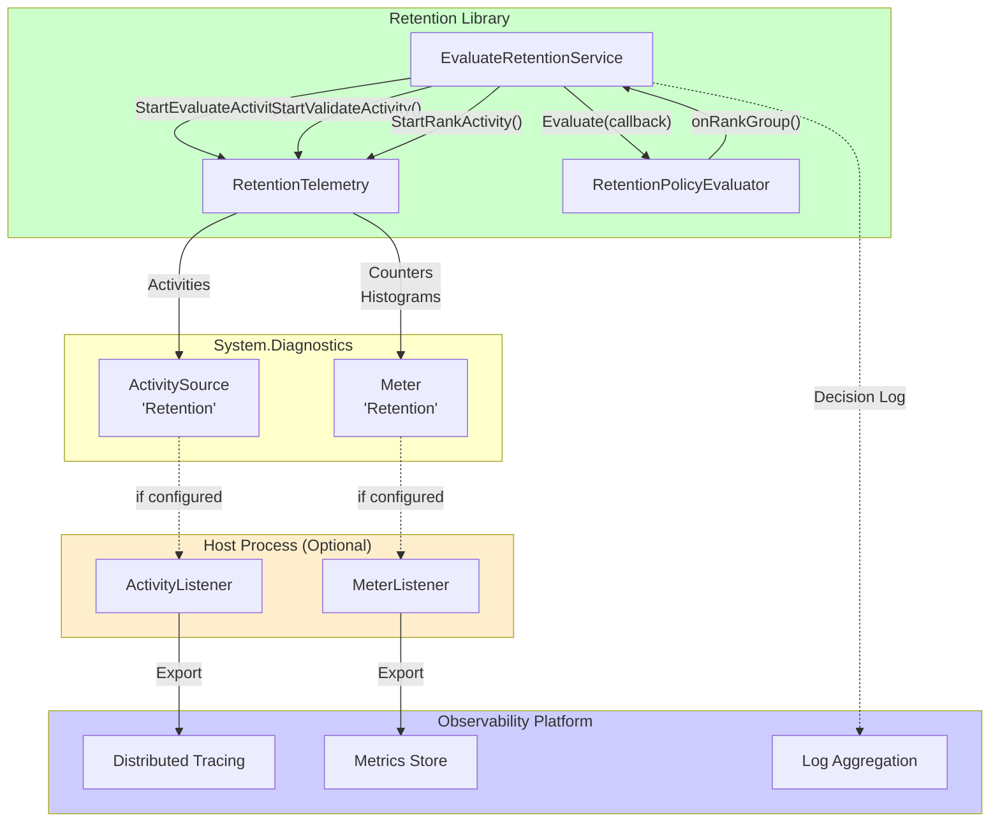
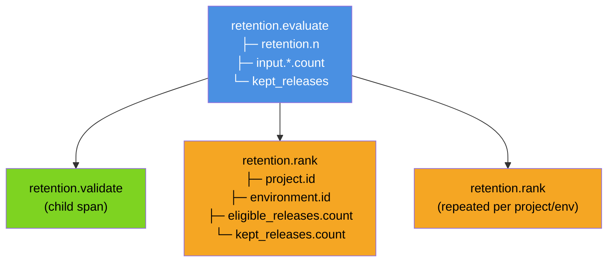

# Observability Addendum

## Telemetry Architecture

## Span Taxonomy

## Purpose
Specify an observability design suitable for productionizing the retention engine, aligned with OpenTelemetry (OTel) patterns. [Source: docs/inputs/Addendum_Request_Observability_and_Deletion.md#Request]

## Scope
- Optional addendum; not required to satisfy the coding exercise deliverables. [Source: Octopus_Deploy_Code_Puzzle-Release_Retention/Start Here - Instructions - Release Retention.md:L25-L40]
- Applies to a host process that calls the retention library (e.g., service/worker). The exercise itself excludes UI/CLI/DB; this addendum does not introduce them as requirements. [Source: Octopus_Deploy_Code_Puzzle-Release_Retention/Start Here - Instructions - Release Retention.md:L34-L38]

## Telemetry Model

### Tracing
**Span taxonomy (Activity)**
- `retention.evaluate` — top-level evaluation span
  - Attributes:
    - `retention.n` (int)
    - `input.projects.count`, `input.environments.count`, `input.releases.count`, `input.deployments.count`
- `retention.rank` — per `(ProjectId, EnvironmentId)` ranking span
  - Attributes:
    - `project.id`, `environment.id`
    - `eligible_releases.count`, `kept_releases.count`
- `retention.validate` — validation span for input normalization and invalid reference handling

**Correlation**
- Correlation identifier is provided by host (trace id) and is included in structured decision log entries. [Source: Octopus_Deploy_Code_Puzzle-Release_Retention/Start Here - Instructions - Release Retention.md:L25-L40]

### Metrics
**Counters**
- `retention_evaluations_total` — count of evaluations
- `retention_invalid_records_total` — invalid references excluded (by reason)

**Histograms**
- `retention_evaluate_duration_ms` — total evaluation duration
- `retention_rank_duration_ms` — per-combination ranking duration

**Gauges (optional)**
- `retention_kept_releases` — number of kept `(ProjectId, EnvironmentId, ReleaseId)` rows per evaluation (export as measurement on completion)

### Logs
The exercise requires: “Log why a release should be kept.” Implement as a structured decision log (already in core design). [Source: Octopus_Deploy_Code_Puzzle-Release_Retention/Start Here - Instructions - Release Retention.md:L25-L40]

**Decision log fields (minimum)**
- `project_id`, `environment_id`, `release_id`
- `n`
- `rank` (1..n)
- `latest_deployed_at`
- `reason_code` (stable)
- `trace_id` / `correlation_id` (if available)

## Operational Views

### SLO-oriented signals (host-defined)
- Error rate: validation/invalid-reference counts vs evaluation count
- Latency: p50/p95 of `retention_evaluate_duration_ms`
- Throughput: evaluations per minute
- Result size: kept releases per evaluation (distribution)

### Runbooks (top 3)
1. **Slow evaluations**: inspect `retention_rank_duration_ms` hotspots by project/environment; validate input sizes; confirm deterministic tie-breakers are not pathological. [Source: docs/03_Architecture.md#Performance Considerations]
2. **Unexpected kept-set**: use decision log to trace ranking inputs, tie-breakers and invalid-reference exclusions. [Source: docs/02_Requirements.md#Functional Requirements]
3. **Invalid input spikes**: check `retention_invalid_records_total` by reason; inspect upstream data source quality. [Source: docs/02_Requirements.md#Functional Requirements]

## Acceptance Criteria (Addendum)
- Telemetry is optional and does not change deterministic retention results.
- Telemetry can be disabled without changing functional behavior.
- No exporter/back-end dependencies are introduced into the core library. [Source: ADR-0007-observability-opentelemetry.md#Decision]
