# Coordinated Deletion Addendum

## Deletion Flow (Future Enhancement)

## Architecture Boundary

```mermaid
flowchart TB
  subgraph Core["✅ Retention Engine (Core)"]
    Eval["Evaluation Logic<br/>Returns: What to KEEP"]
  end
  
  subgraph Host["🔧 Host Layer (Future)"]
    Derive["Derive DeletionPlan<br/>Computes: What to DELETE"]
    Coord["IReleaseDeletionCoordinator<br/>Executes: Deletion with retry"]
  end
  
  subgraph External["🗄️ External Systems"]
    Store[("Artifact Storage")]
    Logs[("Deployment Logs")]
  end
  
  Eval -->|"KeptRelease[]"| Derive
  Derive -->|"DeletionPlan"| Coord
  Coord -->|"DELETE operations<br/>(idempotent)"| Store
  Coord -->|"DELETE operations<br/>(idempotent)"| Logs
  
  style Core fill:#ccffcc
  style Host fill:#ffffcc
  style External fill:#ffcccc
```

## Purpose
Describe a future enhancement to execute coordinated deletion of releases and their associated deployment artifacts/logs, while keeping the coding exercise implementation focused on deciding which releases to keep. [Source: Octopus_Deploy_Code_Puzzle-Release_Retention/Start Here - Instructions - Release Retention.md:L25-L40]

## Origin of the Topic
- The exercise context states that deployments store logs/artifacts and that old releases are consuming storage, motivating the need for retention decisions. [Source: Octopus_Deploy_Code_Puzzle-Release_Retention/Start Here - Instructions - Release Retention.md:L10-L22]
- The addendum request doc identified coordinated deletion as a natural extension of the retention decision capability. [Source: docs/inputs/Addendum_Request_Observability_and_Deletion.md#Request]
- ADR-0006 records the decision to defer coordinated deletion as out of scope for the exercise. [Source: docs/adr/ADR-0006-coordinated-deletion.md#Decision]

## Scope
- **Out of scope for the coding exercise**: no deletion execution, no store contracts required. [Source: docs/adr/ADR-0006-coordinated-deletion.md#Decision]
- **In scope for addendum**: define boundaries and data shapes that would allow deletion to be added later without rewriting core retention logic.

## Design

### Boundary
Introduce a boundary interface in the host layer (not the core retention engine):
- `IReleaseDeletionCoordinator`
  - Input: `DeletionPlan`
  - Output: execution result per release/deployment id (success/failed/transient)

The retention engine remains a pure evaluator and does not call deletion. [Source: docs/03_Architecture.md#Separation of Concerns]

### DeletionPlan (data shape)
A `DeletionPlan` is derived from the evaluator result and includes:
- `Candidates`: list of `(ProjectId, EnvironmentId, ReleaseId)`
- Optional: `DeploymentIdsByRelease` to allow deletion of deployment artifacts tied to the environment

**Derivation rule**
- For each project/environment, all deployed releases beyond the `n` kept releases become deletion candidates.

### Idempotency and retries
Deletion must be idempotent and safe on retries:
- Idempotency key: `(ProjectId, EnvironmentId, ReleaseId)` for release-level deletion; `(DeploymentId)` for deployment artifact deletion.
- Retry only transient failures with exponential backoff + jitter (host policy).
- Never retry validation/domain rule failures. [Source: docs/07_Security_and_Trust_Boundaries.md#Security Hygiene]

### Error handling mapping (addendum)
| Category | Action | Retry | User/Operator message | Log level |
|---|---|---:|---|---|
| NotFound (already deleted) | Treat as success | No | “Already deleted” | INFO |
| Conflict (in use/locked) | Stop for item | No | “Deletion conflict” | WARN |
| Transient dependency | Retry with backoff | Yes | “Temporary failure, will retry” | WARN |
| Unauthorized/Forbidden | Stop, alert | No | “Credential/permission issue” | ERROR |

## Acceptance Criteria (Addendum)
- Coordinated deletion can be added by implementing the coordinator interface, without changing the retention evaluation semantics.
- The core library remains reusable and testable without deletion dependencies. [Source: docs/02_Requirements.md#Non-Functional Requirements]
